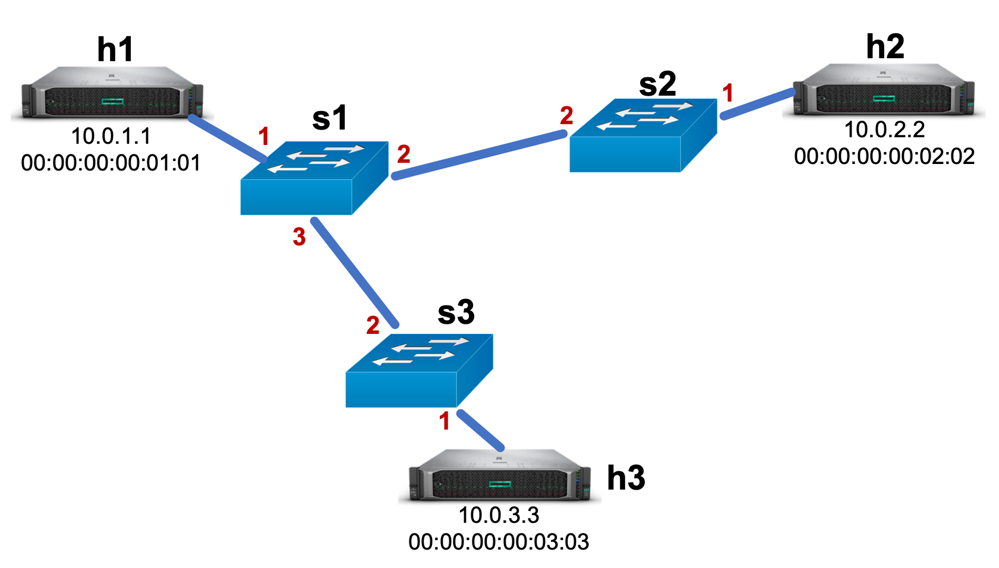

# Project 1: Implementing a Learning Switch

This project is to be done independently.  Parts A+B and Part C are due separately.  Please refer to Canvas for the deadline.

## Introduction

In the project, we will begin our dive into the internals of the Internet.
We will start with implementing a simple learning Ethernet switch.

Ethernet as a standard (IEEE 802.3) defines behavior at both the physical and link layers.
The first Ethernet standard was for a 10 Mbps network with very simple switches.
Many revisions to that standard have since been published, with the most recent (2017) allowing for 400 Gbps networks - and increase of 40,000x increase!
Despite the fact that today's networks look very different than the original Ethernet deployments, Ethernet has adapted and thrived.
Today, nearly all wired networks use Ethernet to communicate within the local-area network.

In this class, we will focus on the Layer-2 aspects of Ethernet.
Messages at this layer are called *frames*, and for Ethernet, they are structured as follows:

[Wikipedia: Ethernet Frames](https://en.wikipedia.org/wiki/Ethernet_frame#Structure)

A learning Ethernet switch is a Layer-2 switch that keeps a forwarding table (destination MAC -> egress port), and learns the content of the table automatically.
Whenever the switch receives a frame, it first learns the source MAC address mapping of the frame.
To send the frame to its destination, it then checks to see if it knows where to send the frame.
If it does, it sends it directly.
If it does not, it broadcasts the packet.

To implement the switch, we will be using programmable switches, and in particular P4, a brand new innovation in networking that we will discuss in more detail later.
To start you off, we have implemented the data plane of the learning switch.
You will be responsible for implementing the control plane, which is responsible for configuring the switch and handling its dynamic behavior.

## Part A: Set up the virtual machine

The first part of this assignment is to set up the virtual machine (VM) you will use for the rest of the course. This will make it easy to install all dependencies for the programming assignments, saving you the tedium of installing individual packages and ensuring your development environment is correct.

#### Step 1: Install Vagrant
Vagrant is a tool for automatically configuring a VM using instructions given in a single "Vagrantfile."  You need to install Vagrant using the correct download link for your computer here: https://www.vagrantup.com/downloads.html.

#### Step 2: Install VirtualBox
VirtualBox is a VM provider (hypervisor). You need to install VirtualBox using the correct download link for your computer here: https://www.virtualbox.org/wiki/Downloads. The links are under the heading "VirtualBox 6.0.0 platform packages."

#### Step 3: Install X Server and SSH-capable terminal
You will need SSH and X Server to input commands to the virtual machine.
 * For Windows, install [Xming](https://sourceforge.net/projects/xming/files/Xming/6.9.0.31/Xming-6-9-0-31-setup.exe/download) and [PuTTY](http://the.earth.li/~sgtatham/putty/latest/x86/putty.exe)
 * For macOS, install [XQuartz](https://www.xquartz.org/) (Terminal is pre-installed)
 * for Linux, both X server and SSH capable terminal are pre-installed.

#### Step 4: Provision virtual machine using Vagrant
Run the command  `vagrant up` in the `projects` directory to start the VM and  provision it according to the Vagrantfile.

**Note**: The following commands will allow you to stop the VM at any point (such as when you are done working on an assignment for the day):
* `vagrant suspend` will save the state of the VM and stop it.
* `vagrant halt` will gracefully shutdown the VM operating system and power down the VM.
* `vagrant destroy` will remove all traces of the VM from your system. If you have important files saved on the VM (like your assignment solutions) **DO NOT** use this command.

#### Step 5: Test SSH to VPN

Run `vagrant ssh` from your terminal. This is the command you will use every time you want to access the VM. If it works, your terminal prompt will change to `vagrant@cis553:~$`. All further commands will execute on the VM. You can then run `cd /vagrant` to get to the course directory that's shared between your regular OS and the VM.

Vagrant is especially useful because of this shared directory structure.  You don't need to copy files to and from the VM. Any file or directory in the `assignments` directory where the `Vagrantfile` is located is automatically shared between your computer and the virtual machine.

The command `logout` will stop the SSH connection at any point.

## Part B: Understand and Document the provided P4 code

#### Step 1: Compile & run

The directory with this README contains the skeleton P4 and control plane code.
The first step is to compile the code.
Doing this will generate a few configurations that might help you.

1. In your shell, run:
  ```bash
   make run
   ```
   This will:
   * Compile `basic.p4`.
   * Generate descriptions of the switch and its Google protobuf interface in `build/`.
   * Start a Mininet instance with three switches (`s1`, `s2`, `s3`) each connected to one host (`h1`, `h2`,
     and `h3`).
   * The resulting topology is depicted below:
   
     Hosts are assigned IPs of `10.0.1.1`, `10.0.2.2`, and `10.0.3.3`, with MAC addresses of `00:00:00:00:01:01`, `00:00:00:00:03:03`, and `00:00:00:00:03:03`, respectively.  Physical port numbers are labeled in red.

2. You should now see a Mininet command prompt. Let's try `arping` from h1 to h2.  `arping` is a utility to test Layer-2 network connectivity by sending a ping message, and getting back a response message.  It then prints out the time it takes to get back the response.  It does this once per second until you quit wit `Ctrl+C`
   ```bash
   mininet> h1 arping -i h1-eth0 -t 00:00:00:00:02:02 10.0.2.2
   ```
   The above command has a few parts:
   * `h1` indicates that mininet should run the subsequent command on h1.
   * `arping` is the command we are running.  You can run `arping --help` for a full list of options.
   * `-i h1-eth0` indicates the local interface that arping should use.  Each of the three hosts has one such interface.
   * `-t 00:00:00:00:02:02` specifies the destination MAC of the arping message.
   * `10.0.2.2` the IP of the target server.  Even though we are not dealing with IP yet, `arping` uses higher-level functionality to get the destination to respond. Note that if either the MAC and IP do not match the target's expectations, it may not respond.

   The above arping command should result in Time Outs because the control plane has not properly configured the switch to be a learning switch.

3. Type `exit` to leave each xterm and the Mininet command line.
   Then, to stop mininet:
   ```bash
   make stop
   ```
   And to delete all pcaps, build files, and logs:
   ```bash
   make clean
   ```
   You will likely want to run `make stop` after every run to ensure that everything closes properly.

### Step 2: Document the P4 code

The `basic.p4` file contains the P4 implementation of the learning switch.
For this project, you will not need to change the P4 implementation.
There are, however, several `TODO` comments scattered across the file.
Your task is to fill in those comments with documentation that explains what each of those functions and code blocks does.
You will be graded on clarity and completeness.

There are a couple resources that might help you.

  * [P4 Specification](https://p4.org/p4-spec/docs/P4-16-v1.0.0-spec.html)
  * [V1Switch code](https://github.com/p4lang/p4c/blob/4646f1603499ebd2d42c6bf51274c18aa48943d3/p4include/v1model.p4)

The P4 specification describes the language and all of its features.
The V1Switch is a P4 framework that provides convenience functions for several common switch features.

### Step 3: Turn it in!

Please submit your documented `basic.p4` file to canvas via the instructions at the bottom of this README.  Everyone should turn in their own version.


## Part C: Finish the learning switch implementation

### Step 1: Implement the control plane

After understanding the switch data plane code, you can now begin implementing the control plane.
In the same directory as this README and the `basic.p4` file, there is a `control_plane.py` file.
Your code goes here in the `ProgramSwitch` function.

To run the control planes, start up mininet as described above in step 1.  In a *second* window:

```console
  vagrant ssh
  cd /vagrant/project1
  python control_plane.py
```

This last command starts up three threads, each running a separate control plane program for the three switches.

A complete control plane implementation should:

1. Properly configure multicast on the switches.
2. Learn new MAC addresses by receiving digests and installing rules appropriately.
3. Your implementations can loop forever and do not need to remove MAC addresses once learning.

A few resources that you might want to browse:

* `build/basic.p4info` contains implementation-specific information on the protobuf API of the switch.
* [P4Runtime protobuf](https://github.com/p4lang/p4runtime/blob/a6f81ac53c6b56d75a9603690794196d67c5dc07/proto/p4/v1/p4runtime.proto) describes the overall protobuf API of the switch.
* `utils/helper.py` contains functions for building P4Runtime requests.
* `utils/switch.py` contains functions for sending P4Runtime requests.
* `utils/convert.py` contains functions for encoding and decoding P4 values.  Note that the protobuf framework is smart enough to do this automatically for values in a protobuf.  Conversion is only necessary for values that P4 uses directly (e.g., table entries, headers, metadata).

### Step 2: Answer questions

Finally, answer the questions in `questions.txt`.

## Submission and Grading

For Parts A and B, please submit your documented `basic.p4` file to Canvas.  Make sure to **Indicate your name and Penn ID in a comment at the top of the file.**

For Part C, submit `basic.p4`, `control_plane.py`, and `questions.txt` files to Canvas. **Again, indicate your name and Penn ID in a comment at the top of all files.**

As always, start early and feel free to ask questions on Piazza and in office hours.


